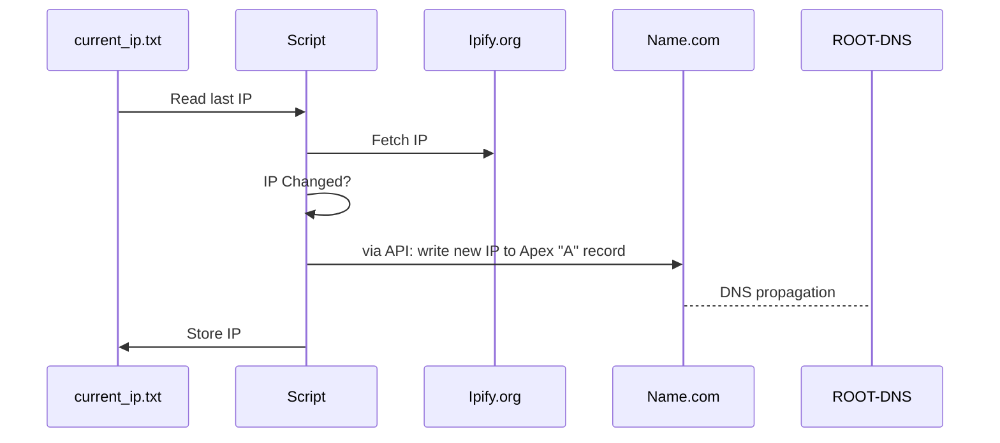
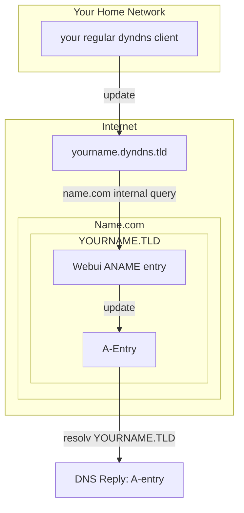

# Name.com Dynamic DNS Updater

A minimal Python script to update Name.com DNS records with your current public IP. Can run locally or in Docker using environment variables or a secrets file.

## Problem

You want your homelab to have an Apex Domain i.e. your.name and not yourname.sophisticateddyndns.provider.tld.
DynDNS Clients are preconfigured for dyndns.tld or duckdns.tld or fritzbox, but not for regular DNS Providers.
Apex domains CANNOT be cname records (so domain.tld CANNOT point to yourname.dyndns.tld) and NEED an A record.

## Solution provided

- select a DNS provider with well documented API (i.e. name.com)
- get own domain.tld for ~10bucks a year
- build an API DNS client to check your IP and update the DNS record

## Limitations

- this custom solution might be less stable than proved software like pupolar dyndns clients or router-builtin solutions
- it relies on external services to check its IP and might even be confused when router via transparent proxies
- while subdomains might change often, apex domains expect static IPs and TTL (time to live) of 300 or more seconds which, in theory, MIGHT EXTEND the time of your Homelab being UNREACHABLE if the dns client actually waits 5 minutes to ask for the current IP.

## Alternative solutions (might be easier then running this script)

- name.com fake ANAME entry - mimics CNAME functions while returning a valid A entry so the DNS Clients thinks your Ip is static.
  - officially, Apex Domains CANNOT have CNAME entries because theese do not return DNS-Servers, MX entries etc.
- Cloudflare Tunnels

## Features

- Updates A records on Name.com
- Reads credentials from environment variables or a YAML secrets file
- Can run locally or in Docker
- Looping IP check with configurable interval

## TODO

- test main.py, run_local.py and run_remote.py
- delete namecom_dnsupdate.py

## Requirements

(tested but any version should do):

- Python ≥ 3.10
- Modules: `requests`, `pandas`, `pyyaml`

### Install dependencies

pip install requests pandas pyyaml

### Usage

#### Testrun

Change settings in main.py and run it.

#### Local

1. rename `secrets.yml.example` to `secrets.yml` and adjust API_USERNAME and API_KEY
2. Change run_local.py variables
3. Run:

python run_local.py

#### Docker / Environment Variables

Set environment variables mentioned in run_remote.py using docker -e or .env

- No need to change python file
